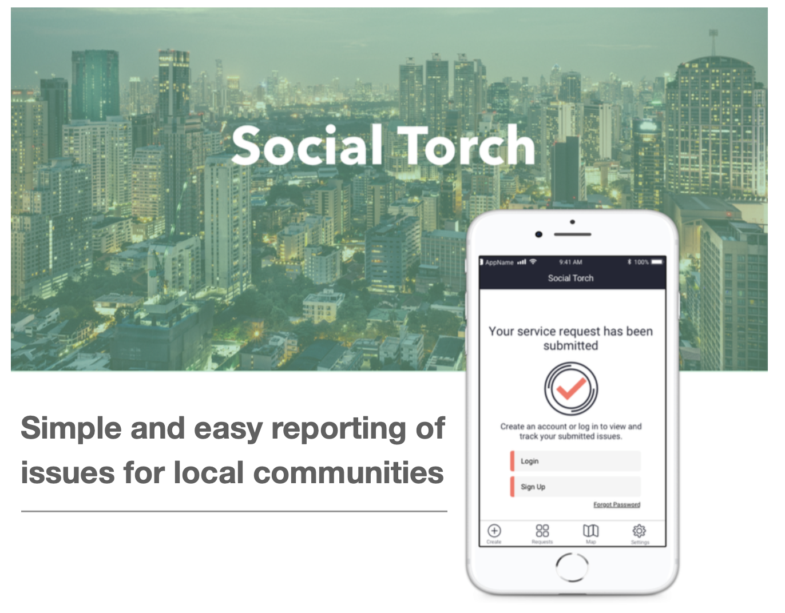

# A Better Way to Connect Citizens to City Services

### The Issue

Municipalities around the world are responsible for providing services to residents. In the event of an emergency, the average taxpayer knows to contact emergency services by calling 911. However, citizens are less aware of how to report a non-emergency issue, such as a pothole, graffiti, street light out or trash collection issue. Some citizens call 911 to report such matters, unnecessarily overwhelming police departments with non-emergency issues. Others know to dial 311, but callers often face long wait times and the cumbersome task of communicating details and locations over the phone. Too often, citizens see and continue to see issues, yet take no action. City governments lack data on where problems are and how to best deploy their resources. Further, residents lack fact-based metrics to hold municipalities accountable.

### A Solution

Social Torch aims to provide citizens and local governments the data and tools needed to identify and resolve these issues efficiently. Our seamless platform enables municipalities to engage citizens as the eyes and ears of the city through a transparent issue reporting system. Social Torch offers citizens a mobile app to report issues by snapping a picture with their smartphone, which automatically records the location. Cities can access a secure application that aggregates and prioritizes requests, dispatches resources, keeps citizens informed, and collects data to inform future planning. Further, the ultimate customers, the residents, can see and track complaints and apply pressure on city officials to solve the real problems.

  

### Social Torch is Open Source

This platform is provide Open Source and you are encouraged to use it to improve your city.

  

